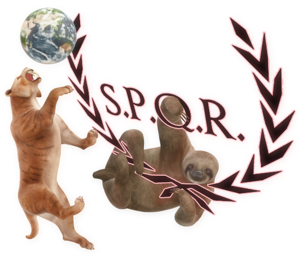

     
     
     
    

#
## **Lomonosov Moscow State University** - Faculty of Computational Mathematics and Cybernetics
### This is my repository oriented on learning and practicing programming skills in C, C++, Python3 and others. For any proposals, desires or provocations you may contact me on Discord media directly -> **Uberariy#7078** or elsewhere (maybe).

#

### For those, who are interested in Discord administration, you should check out my demonstratively designed russian server made for Gaming and History spec. 

- PS: For **non-russian speakers**: Press **Putin** in order to get the channels access!!
- PSS: Beware of trolls, drunken **legionnaires** or ghouls.
- PSSS: It's neither a trap **n**or 100% **s**afe **f**or **w**ork!!

    

